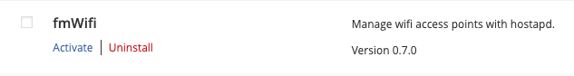

Without modules, facileManager is pretty useless. The [module directory](https://www.facilemanager.com/modules/) allows you to find, learn about, and download the pieces that will make your job as a sysadmin easier. All of the modules in the online directory currently come included with the complete download package.

If you want to download an individual module because you are building from the bare minimum (core package) or a new module was released after your installation, you can grab the package from the [module directory](https://www.facilemanager.com/modules/).

## Install Modules

### Server

Once the desired module has been downloaded and extracted, move the module directory to your web server installation path.

!!! example
    ```
    wget https://www.facilemanager.com/download/module/fmwifi-0.7.0.tar.gz
    tar zxf fmwifi-0.7.0.tar.gz 
    mv facileManager/server/fm-modules/fmWifi /var/www/html/facileManager/fm-modules/
    ```

Point your browser to your server URL and go to Modules.  The newly added module is now displayed in the list, but is not yet installed -- the files are present, but the database is not setup.

Click **_Install Now_** to install the module.


### Client

If a module has a client app (a client directory will exist in the tar file), you will need to install it on the client system you will manage.

!!! example
    ```
    wget https://www.facilemanager.com/download/module/fmwifi-0.7.0.tar.gz
    tar zxf fmwifi-0.7.0.tar.gz 
    mv facileManager/client/facileManager/fmWifi /usr/local/facileManager/
    ```

!!! note
    The facileManager-core client files are necessary to install _before_ the module client files.

Complete the client installation by running the `client.php` script.

!!! note "Example steps to install the fmWifi module"
    `sudo php /usr/local/facileManager/fmWifi/client.php install`

## Activate Modules

Installed modules cannot be used until they get activated.



Click **_Activate_** below the module name to activate it.

Now the module is installed, activated, and ready to be used.  You can switch between modules by selecting it in the hamburger menu in the upper right.


## Deactivate Modules

If you ever want to deactivate a module, simply click **_Deactivate_** below the module name.


!!! note
    This does not delete any data from the database nor filesystem.  This action simply disables the use of the module.

## Uninstall Modules

If you ever want to uninstall a module, you first need to deactivate it and then click **_Uninstall_** below the module name.


!!! warning
    This will delete all associated records and tables from the database, but will leave the files intact on the filesystem.