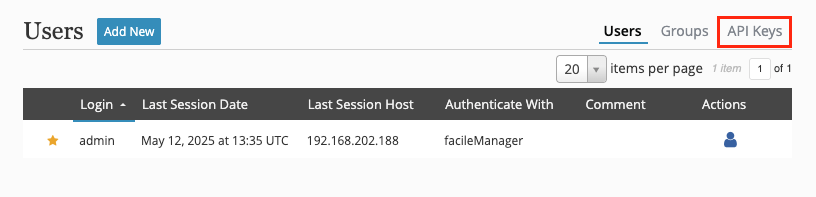

## Authentication
API authentication is done via API key pairs generated through the UI. These keys are tied to specific user accounts and retain the same access-level privileges as the username/password pair.

Just like user accounts, the associated API keys can be enabled, disabled, and deleted.

### API Key Pairs
When the API is enabled, the **_Users & Groups_** page will have a section for _API Keys_.


Each user properties window will also have a link to create an API key pair.


Once the logged in user clicks **_Add New_**, a key pair will be generated and presented to the user.


This key pair will be used to interact with the REST API.

!!! note
    The currently logged in user cannot create API key pairs for any other user.

### Usage

The key pair can be used by [`client.php`](./client.php.md) or any other typical means of interacting with a REST API.

#### `client.php`
After [client installation](../getting-started/basic-install.md#client-installation), add the following to /usr/local/facileManager/config.inc.php on your client(s) from where you want to use the API (substitute the actual values with your own).

```php
define('APIKEY', 'UH27EOM9EUELLUKRX0KDZEAWGN');
define('APISECRET', 'Lyznun1N4gQGILoHqweZLAhGyYrHCQQV7AuUN');
```

Alternatively, you may add the `APIKEY` and `APISECRET` variables to another file and reference it in your API calls with `client.php apicreds=/path/to/file ...`.

#### Other Client
!!! warning "Documentation Missing"
    To be written.

--8<--
footer.md
--8<--
