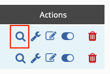
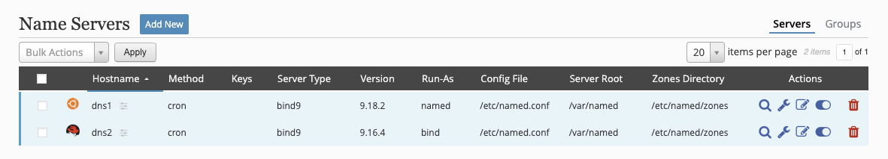
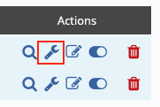
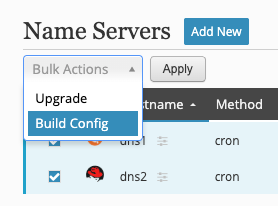
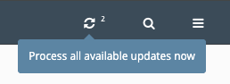

## Server Interaction
### Enable Server
Once you have the [module activated](../../index.md#activate-modules) and the [client app installed](../../../getting-started/basic-install.md#client-installation) on your DNS servers, you will want to review the DNS server's configuration to make sure the installer grabbed the correct information.

Go to **_Config → Servers_** and review the servers.  Once everything is correct, you can enable the server by clicking on the slider in the **_Actions_** column of the server listing.

### Preview Configuration
The configuration for each server can be previewed by going to **_Config → Servers_** and click on the magnifying glass in the **_Actions_** column of the server to preview.

### Build Configuration
Any time a server's configuration needs to be built, the background will turn blue to signify the server needs a configuration built.

When you are ready to build the configuration and deploy it, there are three ways of accomplishing this:

>**Wrench icon**
>> Click on the wrench (or spanner) icon in the server actions column.

>> 

>**Bulk action**
>> Tick the box for each server you want to build the configuration for and select **Config Build** from the **_Bulk Actions_** menu and then click **_Apply_**.

>> 

>**Process all updates**
>> Click the **_Process all updates_** icon in the upper right.

>> 

>> !!! warning
       This will process all available updates for all servers and zones.
