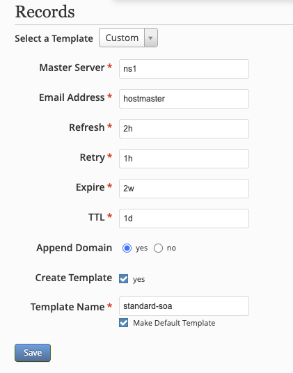
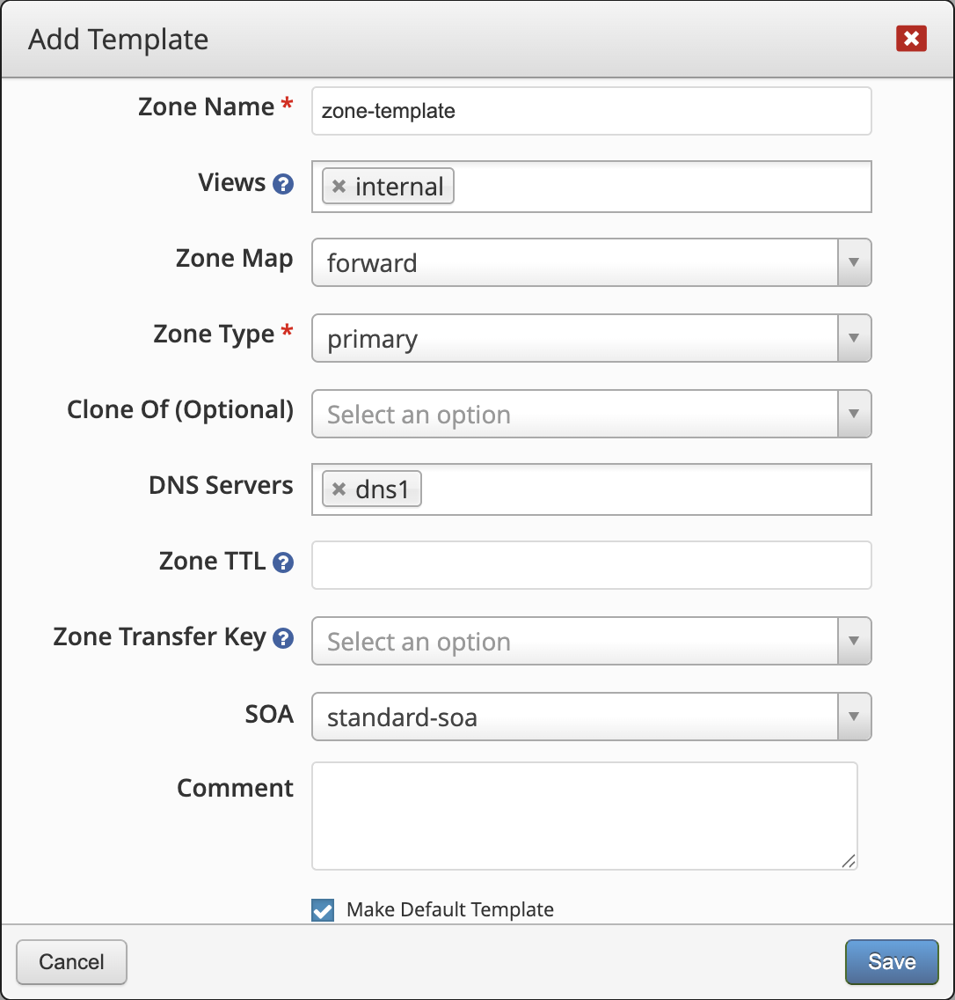
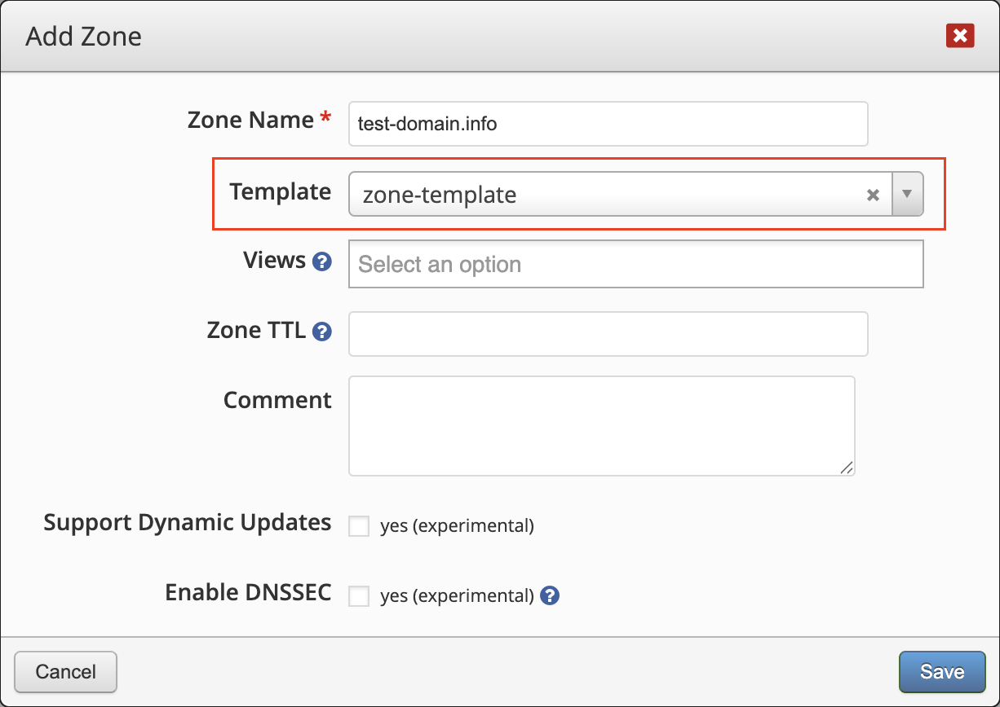

Templates can be used to limit duplicate work.

## SOA
Instead of create the same SOA for multiple zones, you can create a SOA template which can then be applied to an unlimited number of zones. Go to **_Templates → SOA_** to create new and view existing templates. SOA templates can only be deleted when there are no zones associated with them.

_The **'Zone Management'** or **'Super Admin'** permission is required to add, edit, and delete SOA templates._

### Create
New SOA templates can be created in two methods.

#### Method 1
Navigate to **_Templates → SOA_** and click on **Add** and fill out the form.

#### Method 2
When editing the Resource Records (RR) for any zone, go to the **SOA** RR, fill out the form and tick the box to _Create Template_.

This will create the template and automatically assign it to the zone you are currently editing records for.

### Default Template
When a SOA template is set to be the _Default Template_, it will automatically be selected as the SOA when creating new zones.

The SOA template with a star signifies it's the default template.

## Zone
Zones can be saved as a template and applied to an unlimited number of zones. This can speed up your zone additions and management if you have several zones with a similar framework (same DNS servers hosting it, NS records, SOA, other RR, etc.).

Zone templates can only be deleted when there are no zones associated with them. In addition, clones of a zone based on a template cannot be shortened to a DNAME RR.

### Create
New zone templates can be created in two methods.

#### Method 1
Navigate to **_Templates → Zones_** and click on **Add** and fill out the form.

#### Method 2
Navigate to **_Zones_** and click on **Add** and fill out the form and tick the box to _Create Template_.

### Default Template
When a zone template is set to be the _Default Template_, it will automatically be selected as the template when creating new zones.

The zone template with a star signifies it's the default template.

--8<--
footer.md
--8<--
