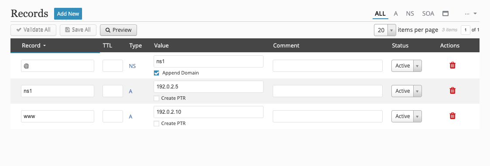
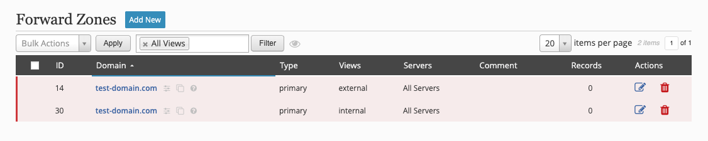

## Split-View DNS
It's common to have multiple views serving zones and sometimes multiple views need to contain zones with the same name, but with different data. This is commonly referred to as "split view dns" or "split brain dns."

A sample configuration might look like this:

```
view internal {
    match-clients { 10/8; };

    zone test-domain.com {
        type primary;
        file "test-domain.com.internal.db";
    };
};

view external {
    match-clients { any; };

    zone test-domain.com {
        type primary;
        file "test-domain.com.external.db";
    };
};
```

We will use this sample configuration and build it with fmDNS. It can be achieved by a couple of different methods, but in either case, the views need to be created first. Go to **_Config → Views_** and add the two views (_internal_ and _external_).


For each of the new views, we need to define the `match-clients` option. Click on the sliders icon next to the view name and add the option.


The two views are setup and it's now time to create the zones.

### Method 1: With Clones
[Zone clones](../getting-started/zones.md#clones) would be appropriate if a few records need to be different, but the majority should be the same for each view. Go to **_Zones → Forward_** and create the external zone and associate it with the **_external_** view.


Now clone the new zone to create the internal zone with the same name and associate it with the **_internal_** view.


There are now two zones with the same name in different views and one is a clone of the other.


Unless you associated a SOA template with the new zones, a SOA record needs to be created. Click on the zone name in the **_external_** view which should be the parent zone. Create the SOA, NS, and any A records.



Click on the cloned zone in the **_internal_** view and you will see the records exist from the parent zone. To make the internal zone unique, create a _private_ record.


When you preview the parent zone you will see both zones show in the preview -- one for each view.

```

===========================================================================
/master/db.test-domain.com.14.hosts:
===========================================================================
 1 ; This file was built using fmDNS 7.1.1 on Wed, 30 Apr 2025 20:26:45 +0000 UTC
 2 
 3 $TTL 1d
 4 test-domain.com. IN SOA ns1.test-domain.com. root.test-domain.com. (
 5 		2025043000	; Serial
 6 		2h		; Refresh
 7 		1h		; Retry
 8 		2w		; Expire
 9 		1d )		; Negative caching of TTL
10 
11 ; Name servers
12 test-domain.com.               IN   NS   ns1.test-domain.com.
13 
14 ; Host addresses
15 ns1                            IN   A   192.0.2.5
16 www                            IN   A   192.0.2.10
17 
18 

===========================================================================
/master/db.test-domain.com.15.hosts:
===========================================================================
 1 ; This file was built using fmDNS 7.1.1 on Wed, 30 Apr 2025 20:26:45 +0000 UTC
 2 
 3 $TTL 1d
 4 test-domain.com. IN SOA ns1.test-domain.com. root.test-domain.com. (
 5 		2025043000	; Serial
 6 		2h		; Refresh
 7 		1h		; Retry
 8 		2w		; Expire
 9 		1d )		; Negative caching of TTL
10 
11 ; Name servers
12 test-domain.com.               IN   NS   ns1.test-domain.com.
13 
14 ; Host addresses
15 ns1                            IN   A   192.0.2.5
16 private                        IN   A   192.0.2.20
17 www                            IN   A   192.0.2.10
18 
19 
```

### Method 2: Without Clones
If the entire zone data is different between the two views then you might choose to create two separate zones with the same name, but associated with different views. Go to **_Zones → Forward_** and create the external zone and associate it with the **_external_** view.


Next, create the internal zone with the same name and associate it with the **_internal_** view.


There are now two zones with the same name in different views and they are independent of one another.



Create the SOA, NS, and any other resource records for each zone.

--8<--
footer.md
--8<--
