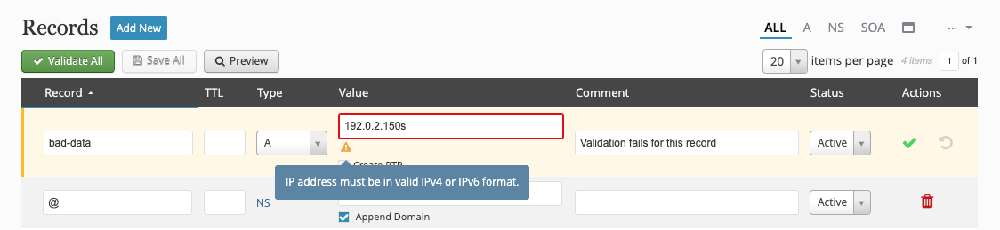
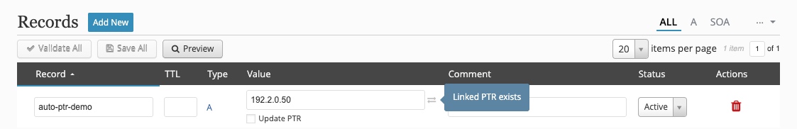
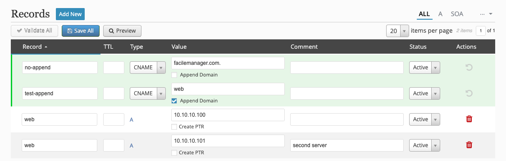
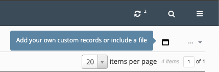

## Resource Records
Zone records are managed by clicking on the zone name from the zone listing. By default, `ALL` resource records (RR) will be displayed, but you can choose which RR to view by selecting one from the upper right. Any RR that has at least one entry will be listed outside of the drop-down menu.

### Form Validation
Whenever you add or edit records, the record(s) will need to be validated before they can be saved. Form validation attempts to ensure the data entered is RFC-compliant and flags any field that has bad data. You can either validate each entry individually or use the **_Validate All_** button to check all new and modified entries.



### Linked PTR Records
`A` records provide the option to automatically create a `PTR` record with the **Create PTR** checkbox. Once an `A` record is created with a `PTR`, the record will show it has a linked `PTR` which can later be updated if the record changes.



!!! note
    If the corresponding reverse zone does not already exist, it can be [automatically created](../settings.md#create-reverse-zones-automatically) during the record validation process.

### Append Domain
Certain records offer the option to automatically **Append Domain** to the record value.


This is helpful if you can't remember if a value needs a trailing period (.) or not.



```
; Aliases
no-append                         IN   CNAME   facilemanager.com.
test-append.test-domain.com.      IN   CNAME   web.test-domain.com.
```

### `CUSTOM` Record
Each zone has a `CUSTOM` RR which allows you to add any other zone data that might not otherwise be supported by fmDNS. Simply click on the `CUSTOM` RR in the upper right, add your content, and **_Save_**.



### Unsaved Records
Whenever a zone has unsaved resource records, there will be a yellow dot next to the domain name in the header as a visual indicator.

