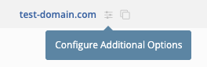
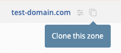
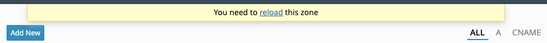
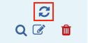

## Create
Zones (aka domains) can be managed from the **_Zones_** menu item. From there you can add, edit, delete, and reload zones depending on your user permissions. Creating forward and reverse zones have many options to consider.

>**Domain Name**
>> **_Required_**

>> A valid RFC-compliant zone name. It does not need to be compliant if it's going to be a template. Reverse zones can be entered by either their subnet value (192.168.1) or by their arpa value (1.168.192.in-addr.arpa). You can also delegate reverse zones by specifying the classless IP range in the zone name (1-128.168.192.in-addr.arpa).

>**Template**
>> **_Optional_**

>> The template the zone will be based on. See [Templates](#templates).

>**Views**
>> Default: `All Views`

>> The view(s) the zone should be a loaded for.

>**Zone Map**
>> **_Required_**

>> Forward or Reverse and this is typically automatically selected based on the page view.

>**Zone Type**
>> Default: `Primary`

>> The type of zone (`primary`, `secondary`, `stub`, `forward`, `url-redirect`).

>> !!! note
       `url-redirect` zone types is only a nomenclature in fmDNS. When the zone is defined with this type, a special `URL` resource record is created that fmDNS will automatically build a web redirect to this URL. To use this zone type, _URL RR Web Servers_ must be defined in the [**_Settings_**](../../../admin/settings.md#define-url-rr-web-servers).

>**Clone Of**
>> **_Optional_**

>> Create the new zone as a clone of another existing zone. See [Clones](#clones).

>**DNS Servers**
>> Default: `All Servers`

>> Choose which DNS servers and/or groups to build the zone on.

>**Domain TTL**
>> **_Optional_**

>> Set the TTL on the zone if it should differ from the SOA. This is particularly used when the zone utilizes a SOA template.

>**Zone Transfer Key**
>> **_Optional_**

>> Choose a TSIG key for transfering this zone if it should differ from the View.

>**SOA**
>> Default: `Custom` or the default SOA template

>> Choose which SOA template to associate with the zone or select 'Custom' to manually enter a new SOA.

>**Comment**
>> **_Optional_**

>> Make notes about the zone.

>**Support Dynamic Updates**
>> **_Optional_**

>> This option allows zone record changes to be made on the DNS server itself (such as through nsupdate). When enabled, fmDNS will compare the zone file from the DNS server with that in the database and make any necessary changes. This option will increase processing time while reloading zones.

>**Enable DNSSEC**
>> **_Optional_**

>> This option enables zones to support DNSSEC signing. You must create the KSK and ZSK before zones will be signed (offline and inline signing are supported). During a configuration build or zone reload, the ZSK and KSK files will stored on the name servers in the directory defined by the most specific key-directory option defined (global, view, zone, server-override, etc.). This option will increase processing time while reloading zones.

>**Create Template**
>> **_Optional_**

>> Create a zone template from this zone. See [Templates](#templates).

_The **'Zone Management'** or **'Super Admin'** permission is required to add, edit, and delete zones and templates._

## Options
You can access the individual zone options by clicking on the "Configure Additional Options" link in the zone edit form or by clicking on the zone options icon next to the zone name:



From there you can configure options [supported by the `zone` block](https://bind9.readthedocs.io/en/latest/reference.html#zone-block-definition-and-usage).

## Groups
Zone groups allow you to group specific zones together for the purpose of restricting user access to specific zones. Instead of listing individual zones a user is restricted access to, you can specify a zone group for easier management.


In addition, zone groups can be used to filter the zones listing.


## Templates
Zones can be saved as a template and applied to an unlimited number of zones. See [Templates](../advanced/templates.md#zone) for more information.

## Clones
You can define a zone as a clone of another previously defined primary zone. The cloned zone will contain all of the same records present in the parent zone. This is useful if you have multiple zones with identical records as you won't have to repeat the record definitions. Clones can also be handy if you want some records to resolve differently in a split-view scenario.

Simply click on the **_Clone this zone_** icon and create the zone as normal.



When you edit the records for a cloned zone, you have the **_Skip Import_** option on each record that comes from the parent.  When skipped, the particular record will not be loaded in the cloned zone on the DNS servers. You can also define new records inside cloned zones for those that are slightly different than the parent.


```
===========================================================================
/master/db.test-domain.com.hosts:
===========================================================================
 1 ; This file was built using fmDNS 7.1.1 on Tue, 29 Apr 2025 19:29:14 +0000 UTC
 2 
 3 $TTL 1d
 4 test-domain.com. IN SOA ns1.test-domain.com. root.test-domain.com. (
 5 		2025042401	; Serial
 6 		2h		; Refresh
 7 		1h		; Retry
 8 		2w		; Expire
 9 		1d )		; Negative caching of TTL
10 
11 ; Name servers
12 test-domain.com.               IN   NS   ns1.test-domain.com.
13 
14 ; Host addresses
15 ns1                            IN   A   192.168.1.5
16 web.test-domain.com.           IN   A   10.10.10.100
17 web.test-domain.com.           IN   A   10.10.10.101 ; second server
18 
19 

===========================================================================
/master/db.test-clone.net.hosts:
===========================================================================
 1 ; This file was built using fmDNS 7.1.1 on Tue, 29 Apr 2025 19:29:14 +0000 UTC
 2 
 3 $TTL 1d
 4 test-clone.net. IN SOA ns1.test-clone.net. root.test-clone.net. (
 5 		2025042900	; Serial
 6 		2h		; Refresh
 7 		1h		; Retry
 8 		2w		; Expire
 9 		1d )		; Negative caching of TTL
10 
11 ; Name servers
12 test-clone.net.                IN   NS   ns1.test-clone.net.
13 
14 ; Host addresses
15 ns1                            IN   A   192.168.1.5
16 web.test-clone.net.            IN   A   10.10.10.101 ; second server
17 web                            IN   A   10.10.10.102 ; third server on clone
18 
19
```

Instead of showing the total number of records in the cloned zone, the zones page will show the total additions and subtractions relative to the parent zone.


!!! note
    Cloned zones will use the SOA from its parent zone except it will have its own `Serial`.

## Reload
After a zone has been successfully built on the associated DNS servers, they can be reloaded going forward. When one or more resource records have been added or modified, that zone gets flagged for reload. There are four ways to reload a zone:

>**Reload link**
>> Click on the **_reload_** link at the top of the zone's records page.

>> 

>**Reload icon**
>> Click on the reload icon in the zone actions column.

>> 

>**Bulk action**
>> Tick the box for each zone you want to reload and select **Reload** from the **_Bulk Actions_** menu and then click **_Apply_**.

>> 

>**Process all updates**
>> Click the **_Process all updates_** icon in the upper right.

>> 

>> !!! warning
       This will process all available updates for all servers and zones.

_The **'Reload Zone'** or **'Super Admin'** permission is required for reloading zones._

## Import

You can import BIND-compatible zone dump files instead of adding zones and records individually. Go to **_Admin → Tools_** and use the Import Zone Files utility. Select your dump file and click **'Import Zones'** which will import any views, zones, and records listed in the file.

--8<--
footer.md
--8<--
