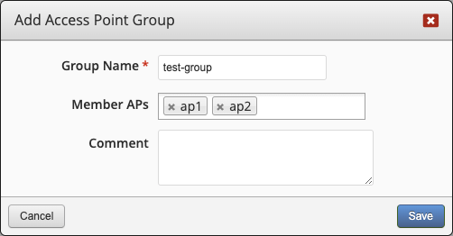

If you have more than one server configured, then you can take advantage of the **Server Groups** which allows you to deploy the same configuration to multiple servers.

Once you have the group defined, you can specify it in when configuring a WLAN and configuration options.